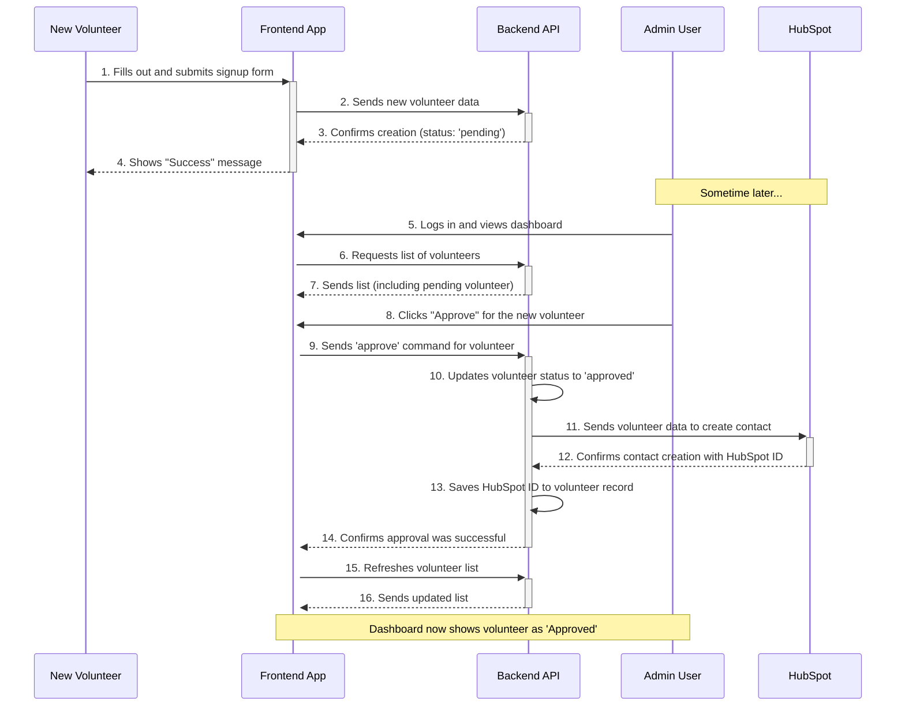
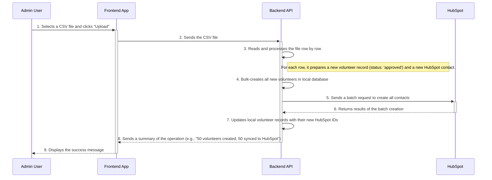

# Activity Diagrams

This document provides activity diagrams to visualize the main workflows in the HopeHands application. An activity diagram is like a flowchart that shows the steps in a process, including actions taken by different people or systems.

You can copy and paste the code blocks below into a Mermaid-compatible viewer to see the visual diagrams.

---

## 1. New Volunteer Signup and Approval Workflow

This diagram shows the end-to-end process from a new volunteer signing up to an admin approving them.

### Explanation of the Workflow

1.  **Signup**: A `New Volunteer` submits their information through the `Frontend App`.
2.  **Storage**: The `Backend API` receives this data and stores it in the local database with a status of `pending`.
3.  **Admin Review**: Later, an `Admin User` logs in and sees the list of pending volunteers on their dashboard.
4.  **Approval**: The admin clicks the "Approve" button.
5.  **Backend Action**: The `Backend API` receives the approval command. It performs two key actions:
    *   It updates the volunteer's status to `approved` in its own database.
    *   It sends the volunteer's information to the external `HubSpot` service.
6.  **HubSpot Sync**: HubSpot creates a new contact and returns a unique ID for that contact. The `Backend API` saves this ID so it can link the local record to the HubSpot record.
7.  **UI Update**: The `Frontend App` automatically refreshes its data, and the admin now sees the volunteer's status as "Approved" on the dashboard.

---

## 2. CSV Bulk Upload Workflow

This diagram shows how an admin can upload a list of pre-approved volunteers from a spreadsheet.

### Explanation of the Workflow

1.  **Upload**: An `Admin User` uploads a CSV file through the `Frontend App`.
2.  **Processing**: The `Backend API` receives the entire file. It reads the spreadsheet and creates a list of new volunteers to be added. It immediately sets their status to `approved`.
3.  **Bulk Creation**: The backend performs two large operations:
    *   It adds all the new volunteers to its local database in a single, efficient operation.
    *   It sends all the new contacts to `HubSpot` in a single batch request, which is much faster than sending them one by one.
4.  **Sync IDs**: After HubSpot confirms the creation, the `Backend API` updates the newly created local records with their corresponding HubSpot IDs.
5.  **Confirmation**: The `Frontend App` receives a confirmation message from the backend and displays it to the admin.
