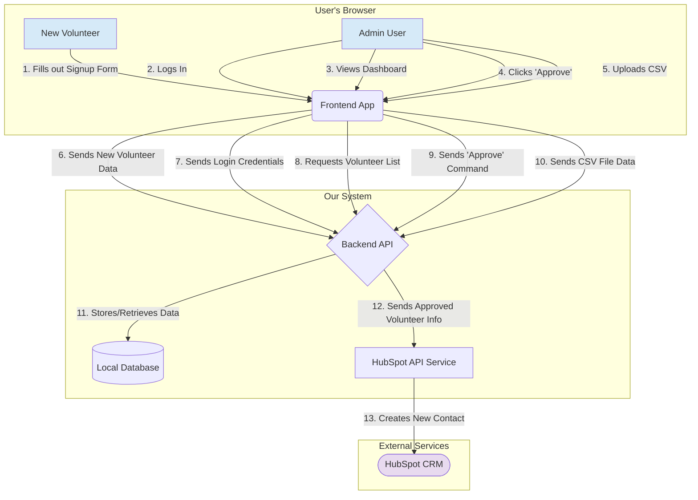

# Data Flow Diagram

This document illustrates how data moves through the HopeHands application. The diagram below is a simplified, high-level overview designed to be easy to understand.

You can copy and paste the code block below into a Mermaid-compatible viewer (like the one in VS Code with a Mermaid extension, or online editors) to see a visual representation of the diagram.

## Explanation of the Flow

This diagram shows the journey of data through the different parts of our system.

1.  **User Interaction (Left Side)**
    *   A **New Volunteer** or an **Admin User** interacts with the **Frontend App** (the website they see in their browser).
    *   They perform actions like filling out a form, logging in, or clicking a button. This is the starting point for any data flow.

2.  **Frontend to Backend Communication**
    *   When a user performs an action, the **Frontend App** sends a request to our **Backend API**.
    *   For example, when a volunteer signs up, their form data is packaged up and sent to the backend. When an admin clicks "Approve," a command is sent.

3.  **Backend Processing (The "Engine Room")**
    *   The **Backend API** is the central hub. It receives all requests from the frontend.
    *   **Local Database**: The backend's primary job is to read from and write to our `Local Database`. This is where all volunteer information is stored, including their `pending`, `approved`, or `rejected` status.
    *   **HubSpot API Service**: When a specific event happens (like a volunteer being approved), the Backend API gives the volunteer's data to a special component, the `HubSpot API Service`.

4.  **External Integration (Right Side)**
    *   The **HubSpot API Service** is responsible for one thing: communicating with the external **HubSpot CRM**.
    *   It takes the data it received from the backend and securely sends it to HubSpot, which then creates a new contact record.

This flow ensures that our application is the "gatekeeper" for the official HubSpot CRM. Data is first stored and vetted in our local database before it is allowed to be sent to the main contact list in HubSpot.
